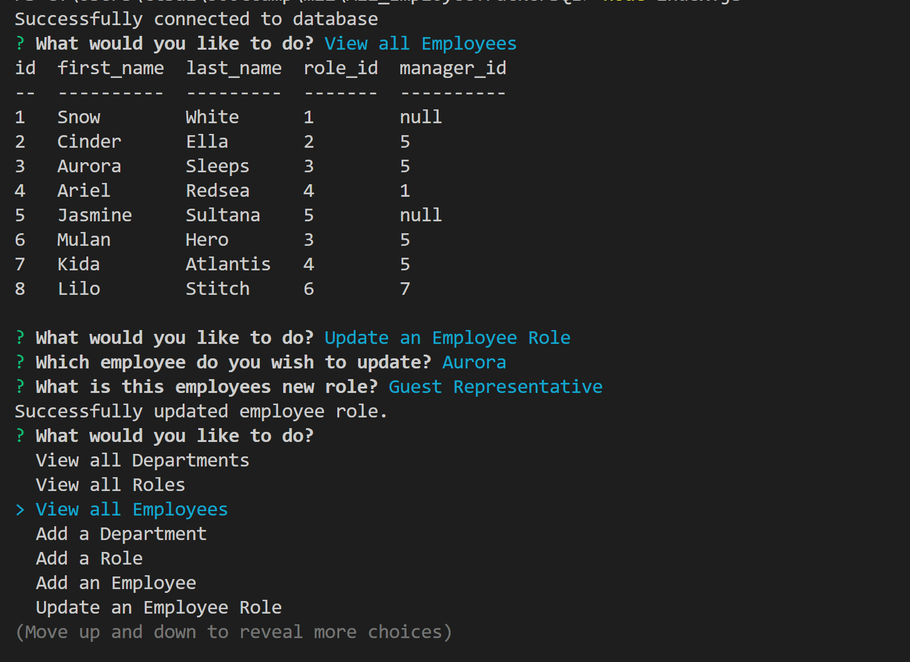

# M12_EmployeeTrackerSQL

## Table of Contents
  * [Description](#description)
  * [Installation](#installation)
  * [Usage](#usage)
  * [Licenses](#license)
  * [Contributing](#contributing)
  * [Credits](#credits)
    
## Description
This is a simple application to track a company's employee database. You can lookup or add departments, employees, and roles. You can also update an employees role if they changed their job title.

## Installation
Please do an `npm i` prior to running the script.
Or individual packages:
`npm install inquirer@8.2.4`
`npm install mysql2`
`npm install console.table`
Recent version of inquirer will not work with this tool.

Please also update your own mysql password into the connection.js. And in terminal run `mysql -u root -p`, enter your password, `SOURCE db/schema.sql` & `SOURCE db/seeds.sql` to get the database started.

Then exit out of mysql and run `node index.js`

## Usage
Sample video link: https://drive.google.com/file/d/1AaWaw2_BLd75oHd5CFyB73J5_AyqVPRE/view

## License
MIT License

## Contributing
Feel free to clone or fork the repo and create any changes you wish to make the application better!

## Credits
* Past student inspiration: https://github.com/jgarcia45/employee-tracker
* https://github.com/jpd61/employee-tracker

